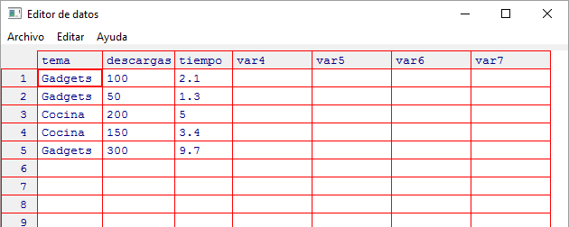
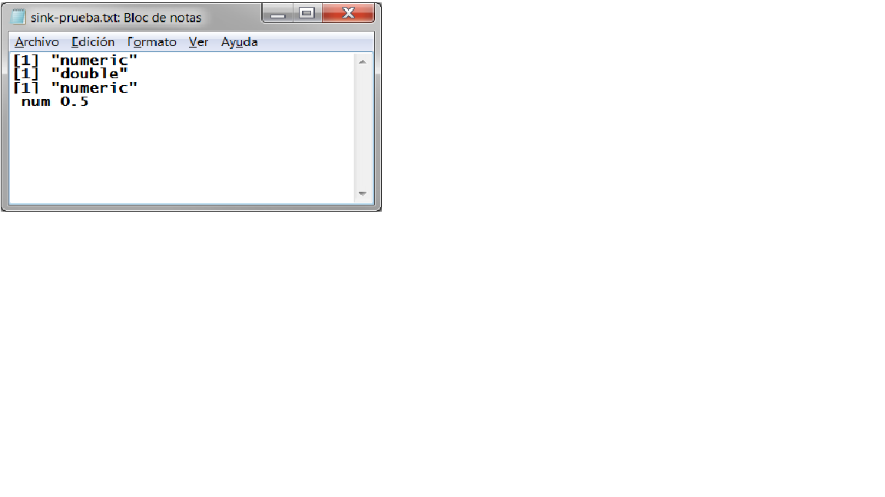
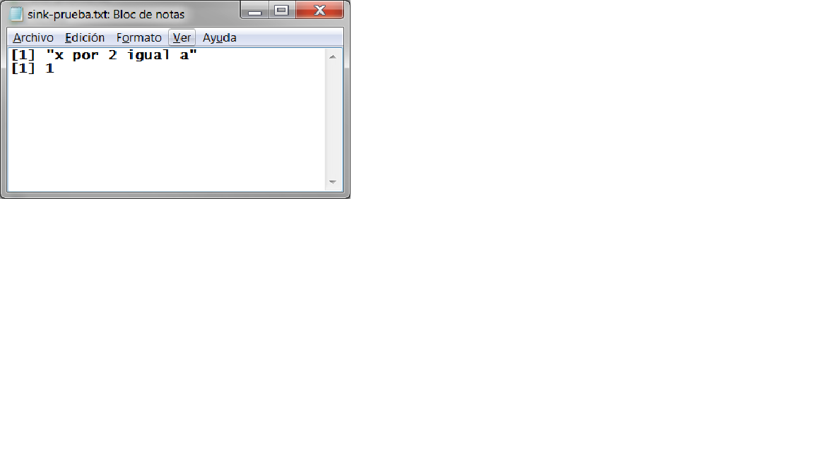

# Lectura - Escritura de datos
E. Vázquez  
Julio 2016  

# Hojas de datos disponibles
Muchos paquetes llevan incluidos hojas de datos, así puede ser muy útil tener un listado de las hojas de datos de ejemplo que hay disponibles. La función **data()** permite realizar esta acción:

**data(..., list = character(), package = NULL, lib.loc = NULL, verbose = getOption("verbose"), envir = .GlobalEnv)**

donde:

**- ...** nombres de las hojas de datos (cadenas de caracteres)

**- list** vector de caracteres	

**- package** vector de caracteres indicando el paquete o paquetes dentro de los cuales hay que buscar las hojas de datos o NULL	

Por defecto, se busca en todos los paquetes del directorio de búsqueda, después se busca en el subdirectorio 'data' del directorio de trabajo, si existe.

**- lib.loc	** Nombres de los directorios de las librerías de R dónde buscar (vector de caracteres) o NULL. NULL es el valor por defecto y corresponde a todas las librerías conocidas en el momento de la llamada a la función.

**- verbose**	 Si es TRUE, se imprime información adicional,


**- envir**	define el entorno en el que deben cargarse los datos.


```r
data()
```


```r
head(datos$results)
```

```
##      Package    LibPath                             
## [1,] "datasets" "C:/Program Files/R/R-3.3.0/library"
## [2,] "datasets" "C:/Program Files/R/R-3.3.0/library"
## [3,] "datasets" "C:/Program Files/R/R-3.3.0/library"
## [4,] "datasets" "C:/Program Files/R/R-3.3.0/library"
## [5,] "datasets" "C:/Program Files/R/R-3.3.0/library"
## [6,] "datasets" "C:/Program Files/R/R-3.3.0/library"
##      Item                    
## [1,] "AirPassengers"         
## [2,] "BJsales"               
## [3,] "BJsales.lead (BJsales)"
## [4,] "BOD"                   
## [5,] "CO2"                   
## [6,] "ChickWeight"           
##      Title                                           
## [1,] "Monthly Airline Passenger Numbers 1949-1960"   
## [2,] "Sales Data with Leading Indicator"             
## [3,] "Sales Data with Leading Indicator"             
## [4,] "Biochemical Oxygen Demand"                     
## [5,] "Carbon Dioxide Uptake in Grass Plants"         
## [6,] "Weight versus age of chicks on different diets"
```


Si queremos listar todos las hojas de datos de todos los paquetes:


```r
data(package = .packages(all.available = TRUE))
```

```
> Warning in data(package = .packages(all.available = TRUE)): datasets have
> been moved from package 'base' to package 'datasets'
```

```
> Warning in data(package = .packages(all.available = TRUE)): datasets have
> been moved from package 'stats' to package 'datasets'
```


# Lectura de datos
La función **scan()** permite leer datos de un vector, lista, fichero o consola.

Para leer datos de un fichero resulta más práctico usar **read.table()** y **write.table**, por ejemplo u otras funciones similares.

Sin embargo, resulta muy útil para leer datos desde el teclado.

Esta función permite introducir elementos al objeto interactivamente a través de la consola hasta que introducimos *[enter]*.
Con *scan()*, la asignación de valores al vector *x = (1,2,3,4,5,6,7,8,9,10)* quedaría:


```r
> x <- scan()
1: 1
2: 2
3: 3
4: 4
5: 5
6: 6
7: 7
8: 8
9: 9
10: 10
11: 
Read 10 items
```

# Interfaces tipo hoja de cálculo
R dispone de algunas funciones que permiten introducir o editar datos, bien sean hojas de datos o variables:

* dataentry()
* data.entry()
* de()

Estas funciones sólo están disponibles en algunas plataformas o GUIs, como Windows.

Para ver el uso de estas funciones, empezaremos por crear una hoja de datos con los datos recogidos sobre 5 vídeos de cierta plataforma, que incluyen la temática, el número de descargas (en miles) y el tiempo de visualización (minutos) de cada uno.

Estos datos se recogen en la siguiente tabla:

Temática  | Nº de descargas | Tiempo
--------- | ----------------|-------
Gadgets   | 100             | 2.1
Gadgets   | 50              | 1.3
Cocina    | 200             | 5.0
Cocina    | 150             | 3.4
Gadgets   | 300             | 9.7


La hoja de datos quedaría definida mediante:


```r
videos<-data.frame(tema=c("Gadgets", "Gadgets", "Cocina", "Cocina", "Gadgets"), descargas=c(100, 50, 200, 150, 300), tiempo=c(2.1, 1.3, 5.0, 3.4, 9.7))
```


Así, tendremos tres variables, llamadas *tema*, *descargas* y *tiempo* con valores correspondientes a 5 individuos y contenidos en el objeto llamado *videos*.


```r
videos
```

```
>      tema descargas tiempo
> 1 Gadgets       100    2.1
> 2 Gadgets        50    1.3
> 3  Cocina       200    5.0
> 4  Cocina       150    3.4
> 5 Gadgets       300    9.7
```

## dataentry() 
Esta es la función primitiva:

> **dataentry(data, modes)**


donde:

**- data** es una lista de vectores numéricos o de caracteres.

**- modes** es una lista de las clases (o algunas de ellas)	de las variables. Se puede usar la función *list()*.

## data.entry()
Falta explicar .....


## edit()
La función *edit()* está basada en la función *data.entry()*

Cuando llamamos a ésta función incluyendo como argumento el nombre de un objeto, nos muestra su contenido en un editor de texto, por ejemplo el *Bloc de notas* si trabajamos con Windows.

Si el argumento que se le pasa es un objeto de tipo *data.frame*, entonces se abre una ventana tipo hoja de cálculo mediante la cual podemos editar dicha hoja de datos. 

La edición sólo se mantendrá si la asignamos a un objeto, a uno nuevo o al mismo.

Veamos un ejemplo, vamos a editar el *data.frame* *videos*:


```r
edit(videos)
```

Se abre la siguiente ventana:


# Redireccionar la salida
Para enviar los resultados de un script a un fichero, podemos usar **sink**
> **sink(file = NULL, append = FALSE, type = c("output", "message"), split = FALSE)**

Donde:

**- file**

**- append**

**- type**

**- split**

Veamos un ejemplo. Sea el siguiente conjunto de instrucciones cuya ejecución y resultados se muestra en la consola:


```r
x <- 0.5
class(x)
```

```
> [1] "numeric"
```

```r
typeof(x)
```

```
> [1] "double"
```

```r
mode(x)
```

```
> [1] "numeric"
```

```r
str(x)
```

```
>  num 0.5
```

Si queremos enviar los resultados de los comandos a un archivo llamado *sink-prueba.txt*, por ejemplo, la primera instrucción del *script* debe ser la función *sink()*, pasándole el nombre (y ruta si fuera necesario) del fichero como argumento:


```r
sink(file = "sink-prueba.txt")
# O bien
# sink("sink-prueba.txt")

x <- 0.5
class(x)
```

```
> [1] "numeric"
```

```r
typeof(x)
```

```
> [1] "double"
```

```r
mode(x)
```

```
> [1] "numeric"
```

```r
str(x)
```

```
>  num 0.5
```

En el directorio de trabajo se habrá creado, si no estaba ya creado, el archivo de texto *sink-prueba.txt*.

Veamos el contenido del archivo:



Si el fichero *sink-prueba.txt* estuviera creado previamente, el resultado del script lo escribiría en él, pero machacando cualquier resultado previo que contuviera.

Veamos que pasa con el contenido de *sink-prueba.txt* después de las siguientes instrucciones:


```r
sink(file = "sink-prueba.txt")
paste("x por 2 igual a")
```

```
> [1] "x por 2 igual a"
```

```r
x*2
```

```
> [1] 1
```



El contenido del archivo se ha remplazado por los resultados del último script.

Para evitar esta situación, en caso que queramos añadir nuevos resultados al archivo, usamos el argumento *append*:


```r
sink(file = "sink-prueba.txt", append = T)
x <- 0.5
class(x)
```

```
> [1] "numeric"
```

```r
typeof(x)
```

```
> [1] "double"
```

```r
mode(x)
```

```
> [1] "numeric"
```

```r
str(x)
```

```
>  num 0.5
```

A los resultados que contenía el fichero de texto se le añaden el de este último *script*:


Hay que tener en cuenta que una vez redireccionada la salida de resultados al fichero *sink-prueba.txt*, mientras no se revierta la redirección a la consola o a otro archivo, la salida por defecto será *sink-prueba.txt*.

En este caso, si no volvemos a ejecutar *sink(file = "sink-prueba.txt")*, el resultado de todos los comandos que se ejecuten se irán añadiendo a este archivo de texto, sin necesidad del argumento *append*.


Para terminar la redirección ejecutamos **sink(file = NULL)** o simplemente **sink()**.

Hay que tener en cuenta que cada vez que se ejecuta el comando *sink* especificando una salida, R asigna un número de redirección.

En este caso, hemos llamado 3 veces a la función *sink()*, por lo que ha creado 3 redirecciones, de momento. Este valor lo podemos ver con la función **sink.number()**.

Veamos:

```r
sink(file = "sink-prueba.txt")

sink.number()
```

```
> [1] 1
```

Si abrimos *sink-prueba.txt* veremos el número de redirecciones y ese será el número de veces que hemos de cerrar la redirección para que los resultados vuelvan a visualizarse en la consola:


```r
sink()
sink()
sink()
sink()
```

Vamos a crear otro archivo *sink-prueba2.txt* y a empezar de nuevo:


```r
#sink(file = "sink-prueba2.txt")
```

Ahora ejecutamos algunas instrucciones cuyo resultado irá a dicho archivo de texto:

```r
x <- 0.5
class(x)
```

```
> [1] "numeric"
```

```r
typeof(x)
```

```
> [1] "double"
```

```r
mode(x)
```

```
> [1] "numeric"
```

```r
str(x)
```

```
>  num 0.5
```

Miremos el contenido del archivo de texto y, sin necesidad de volver a abrir otra redirección, ni añadir ningún argumento, ejecutamos nuevas instrucciones:


```r
paste("x por 2 igual a")
```

```
> [1] "x por 2 igual a"
```

```r
x*2
```

```
> [1] 1
```

Volvemos a ver el contenido de *sink-prueba2.txt* y añadimos un nuevo comandos:

```r
#sink.number()
```


Podemos observar que en esta ocasión sólo se ha abierto una redirección, así, bastará cerrarla una vez para volver a visualizar los resultados en la consola:

```r
#sink()
```

Si volvemos a ejecutar algún comando:

```r
y <- 3
y
```

```
> [1] 3
```

Los resultados ya se ven en nuestra consola.


