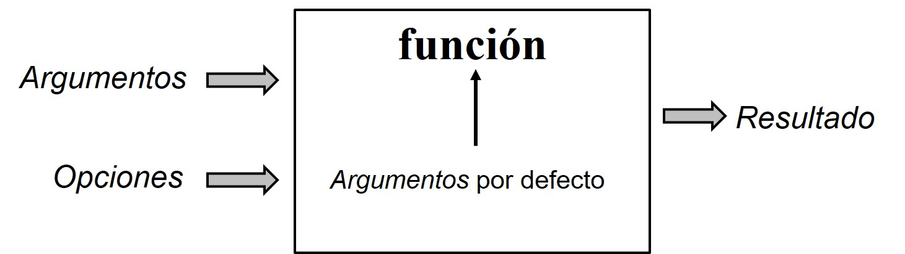
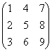
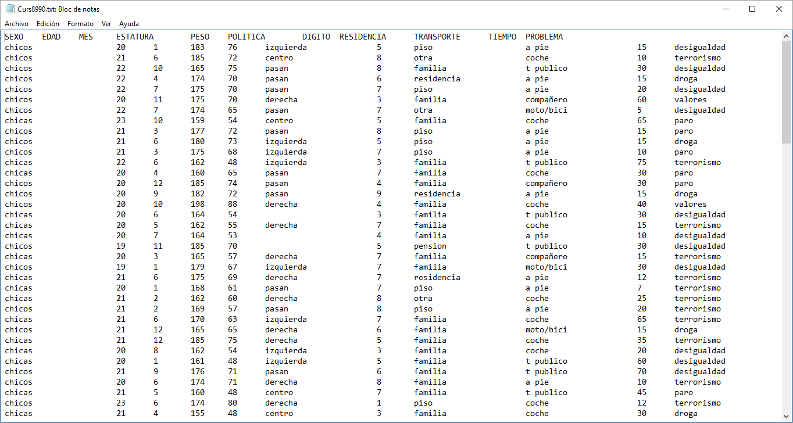
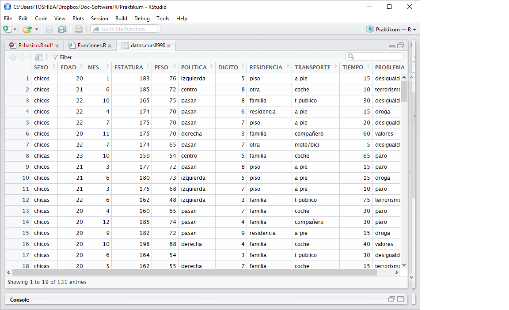

# Primeros pasos con R: objetos y funciones básicas
E. Vázquez - V. Chirivella - R. Alcover  
Junio 2016  


# ¿Empezamos?
Nada más comenzar la sesión de R en la **consola** nos está esperando el cursor.
El cursor, que por defecto es el símbolo ‘>’, indica que R está listo para recibir un comando: 

```r
>
```

Por ejemplo, podemos usar R como una calculadora:


```r
5+3
```

```
> [1] 8
```

```r
5*0.7-1
```

```
> [1] 2.5
```

Obervar que para la **notación decimal** se usa el punto **"."**

En Windows, algunos comandos pueden ser ejecutados a través de los menus interactivos (por ej. buscar ayuda en línea, abrir archivos, . . . ) si usamos algún interzaz como *R Studio* o *R Comannder*.

Si sólo pudiéramos usar R como una calculadora..., no valdría la pena tanto esfuerzo, por tanto, vamos a seguir...

# ¿Qué es un objeto?
R es un lenguaje Orientado a Objetos:

>**casi TODO lo que se maneja, crea o destruye son objetos, cada uno con su nombre, su tipo y otras características.**

Podemos modificar o manipular estos objetos con **operadores** (aritméticos, lógicos, y comparativos) y **funciones** (que a su vez son objetos).

El uso y funcionamiento de los operadores es bastante intuitivo y se expondrá más adelante.

Por otra parte, R es un lenguaje interpretado (como Java) y no compilado (como C, C++, Fortran, Pascal, . . . ), lo cual significa que los comandos escritos en el teclado son ejecutados directamente sin necesidad de construir ejecutables.
Todo ello proporciona a R simplicidad y flexibilidad.

# Generación y manipulación de objetos

## Creación y asignación
Un objeto se crea en el momento en el que se le asigna un contenido (valor, letra, etc...).
Para **asignar** un valor a un objeto se utiliza el **operador** *asignar*: **<-**


```r
x <- 3
```
En este momento acabas de crear tu primer objeto, objeto al que hemos llamado **x** y es numérico (luego hablaremos más sobre los tipos de objetos)

A partir de ahora dicho objeto está en memoria y mientras no se cierre la sesión de R podremos hacer uso de él. Podemos darle otro valor, combinarlo con otros objetos para formar nuevos objetos o eliminarlo.

Para ver el contenido de un objeto, no tenemos más que escribir su nombre en la consola y ejecutar.


```r
x 
```

```
> [1] 3
```

A ese mismo objeto podemos asignarle otro valor.


```r
x <- 5
x
```

```
> [1] 5
```
Incluso podemos reasignarle su propio valor (recursividad)


```r
x <- x*2
```
¿Adivinas el nuevo valor de x?


```r
x
```

```
> [1] 10
```
También podemos asignarle una expresión

```r
y <- 0.5
z <- x + y + 3
```

Múltiples asignaciones pueden escribirse en la misma línea separadas por comas

```r
y <- 0.5; z <- x + y + 3; nombre <- "Juan"
```

## ¿Qué objetos se han creado?
Para conocer qué objetos están activos en un momento dado de la sesión de R pueden usarse diversas instrucciones o comandos. Veamos algunos.

La función *ls()* simplemente lista los objetos en memoria: sólo se muestran los nombres de los mismos.


```r
ls()
```

```
> [1] "nombre" "x"      "y"      "z"
```

o bien


```r
objects()
```

```
> [1] "nombre" "x"      "y"      "z"
```

## ¿Dónde están los objetos creados?
Los objetos creados o cargados desde algún fichero u otra fuente se almacenan temporalmente en un espacio de memoria denominado **workspace** o área de trabajo mientras dure la sesión de R.

Los objetos listados por las funciones anteriores son los que están en el *workspace*.

Para conservar los objetos del área de trabajo una vez que la sesión finalice, hay que guardarlos en fichero de datos de R o exportarlos a otro formato.

Si no hemos guardado los objetos en algún lugar especial (fichero, etc), R pregunta si queremos guardar el espacio de trabajo, si es así, guardará todo lo que tenemos en *workspace* en el aechivo llamado, por defecto, **.RData**

## Eliminación
Un objeto se elimina con la función *remove*.

Por ejemplo:

```r
rm(z)
```

Podemos comprobar que *z* ya no está en memoria:

```r
objects()
```

```
> [1] "nombre" "x"      "y"
```
# Nombres de objetos
El nombre que le demos a los objetos debe cumplir ciertas reglas:

* puede incluir letras (A-Z o a-z), dígitos (0-9), puntos (.) o subguión (_). 
* debe comenzar con una letra (A-Z o a-z) o con un punto (.)
* si empieza con punto (.), no puede continuar con un dígito, aunque el punto (.) puede ir seguido de dígito si no es el primer punto del nombre.


R discrimina entre letras mayúsculas y minúsculas para el nombre de un objeto, de tal manera que x y X se refiere a objetos diferentes (inclusive bajo Windows).


```r
X <- 200
a3 <- 80
A3 <- 0.01
EstoEsUnaVariableNoNumerica <- "Hola"
EstoEsUnaVariableNoNumerica2 <- "ABC"
Esto.Es.Una.Variable.No.Numerica <- "letras"
.variable <- "Esto también es un nombre válido"
```
El resultado sería:

```r
X
```

```
> [1] 200
```

```r
a3
```

```
> [1] 80
```

```r
A3
```

```
> [1] 0.01
```

```r
EstoEsUnaVariableNoNumerica
```

```
> [1] "Hola"
```

```r
EstoEsUnaVariableNoNumerica2
```

```
> [1] "ABC"
```

```r
Esto.Es.Una.Variable.No.Numerica
```

```
> [1] "letras"
```

```r
.variable
```

```
> [1] "Esto también es un nombre válido"
```
Prueba a crear el siguiente objeto:

```r
3A <- 5
```

```
> Error: <text>:1:2: unexpected symbol
> 1: 3A
>      ^
```
# Operadores
Los operadores se clasifican en tres grupos.
La siguiente tabla muestra los operadosres básicos de R (y de cualquier lenguaje de programación)

Aritméticos        | Comparativos          | Lógicos
------------------ | --------------------- | ------------------
+   adición        | <  menor que          | !  NO lógico
-   sustracción    | >  mayor que          | &  Y lógico
*   multiplicación | <= menor o igual que  | \|  O lógico
/   división       | >= mayor o igual que  | xor() O exclusivo
^   potencia       | == igual              |                  
%%  módulo         | != diferente de       |                   

Los operadores aritméticos son conocidos por todos. Sin embargo, aunque los lógicos también los usamos frecuentemente, se hace de manera incosciente y merece la pena que les dediquemos unas líneas.

Un objeto de tipo lógico tiene dos valores posibles **TRUE** (verdadero) o **FALSE** 
(falso). Y el resultado de la aplicación de operadores lógicos sobre ellos producen como resultado uno de estos valores (**T** o **F**).

Veamos algún ejemplo:

```r
EsRojo <- FALSE
EsBlanco <- TRUE
EsAzul <- FALSE
```
Vamos modificar estos objetos mediante algunos operadores lógicos:

```r
EsBlanco | EsRojo
EsBlanco | EsAzul
EsBlanco & EsRojo
EsBlanco & EsAzul
```

Ahora veamos los resultados que se producen tras la aplicación de operadores lógicos a los objetos creados.


```r
EsBlanco | EsRojo
```

```
> [1] TRUE
```

```r
EsBlanco | EsAzul
```

```
> [1] TRUE
```

```r
EsBlanco & EsRojo
```

```
> [1] FALSE
```

```r
EsBlanco & EsAzul
```

```
> [1] FALSE
```
Como ya sabemos, el resultado puede almacenarse en un nuevo objeto:

```r
NoEsRojo <- !EsRojo
NoEsRojo
```

```
> [1] TRUE
```

Los siguientes caracteres también son operadores en R: $, [, [[, :, ?, <-.

# Funciones
Una función es en realidad un tipo de objeto, denominado **function**, y está formada por una o varias expresiones o incluso otras funciones (recordar que tanto las expresiones como las funciones son objetos) a las que se les da un nombre y que pueden producir nuevos objetos.
Un ejemplo de funciones son *ls()* o *rm()* utilizadas antes.

Otros objetos se explicarán con más detalle más adelante, pero para poder seguir avanzando es necesario disponer de cierta información previa. 

Cuando se hace referencia a una función para hacer uso de ella (en el argot de programación decimos que *"se llama"* a una función), debe hacerse mediante el nombre seguido de una serie de información o datos de entrada denominados **argumentos** entre paréntesis ().

En ocasiones a las funciones no se les proporciona ningún argumento, aún así deben ir acompañadas de los paréntesis. 

Cuando se lamma a una función se ejecutan o evalúan todas las expresiones que contiene sin necesidad de volverlas a escribir.

Por ejemplo, para borrar el objeto z, llamamos a la función *rm* y le proporcionamos, entre paréntesis, los argumentos, en este caso el objeto a eleminar *(z)*:


```r
rm(z)
```
Esta función no genera ningún nuevo objeto, pero sí un resultado.

Si queremos listar los objetos que hay creados en un momento dado, llamamos a la función *ls* y le proporcionamos, entre paréntesis, los argumentos, en este caso ninguno *()*


```r
ls()
```

```
>  [1] "a3"                               "A3"                              
>  [3] "EsAzul"                           "EsBlanco"                        
>  [5] "EsRojo"                           "Esto.Es.Una.Variable.No.Numerica"
>  [7] "EstoEsUnaVariableNoNumerica"      "EstoEsUnaVariableNoNumerica2"    
>  [9] "NoEsRojo"                         "nombre"                          
> [11] "x"                                "X"                               
> [13] "y"
```
Esta función produce un nuevo objeto que es la lista de objetos existentes en memoria.


R dispone de un conjunto de funciones básicas que pueden usarse desde el momento que éste se instala. También dispone de cientos de funciones que no se cargan con la primera instalación del entorno R, pero que pueden instalarse y cargarse en cualquier momento, siempre que se tenga acceso a Internet. Estas funciones vienen agrupadas en los que se denominan **packages**  (paquetes) o **library** (librerías).
Además, nosotros podemos construir también nuevas funciones.

Las funciones pueden contener desde un conjunto pequeño de expresiones sencillas, como por ejemplo calcular la media) hasta complejas y largas secuencias de código que permiten llevar a cabo un análisis de regresión.



# Contenido de los objetos
Hemos visto que R trabaja con objetos los cuales tienen **nombre** y **contenido**, pero también tienen **atributos** que especifican el tipo de datos representados por el objeto. 

Para entender la utilidad de estos atributos, consideremos un objeto que representa *el núumero de asignaturas suspendidas por un alumno*. Este objeto sería una variable que podría tomar los valores 1, 2, o 3, esto es, números enteros. Análogamente podríamos considerar otro objeto con los mismos valores que representaran el código o etiqueta que le asignamos a una característica categórica o cualitativa  (por ejemplo, el *sexo de los individuos en una poblacóon de crustáaceos: macho, hembra, o hermafrodita*).

**¡Las herramientas estadísticas a utilizar, así como los resultados, no serán las mismas en ambos casos!**. En R, los atributos del objeto proporcionan la información necesaria para distinguir las dos situaciones. 

En general, y hablando un poco más técnicamente, la acción de una función o de un operador sobre un objeto depende de los atributos de este último.

Todo objeto tiene dos atributos intrínsecos: **clase** (o tipo) y **longitud**.

## Clase de un objeto
El tipo se refiere a la **clase** básica de los elementos en el objeto. Aunque muy habitualmente se usan los términos clase y tipo indistintamente no son los mismo.

Existen cuatro clases principales:

* numérico
* caracter
* complejo
* lógico (FALSE o TRUE)

Existen otros tipos, pero no representan datos como tal (por ejemplo funciones o expresiones).

Para ver el tipo de un objeto se puede usa la función *class()* (o *mode()*).

Veamos los siguientes objetos a los que les asignamos un contenido:

```r
x <- 2
y <- 0.5
z <- x + y + 3
nombre <- "Juan"
EsCierto <- TRUE
w <- 3i
```

Si queremos conocer la clase de estos objetos:


```r
class(x)
```

```
> [1] "numeric"
```

```r
class(y)
```

```
> [1] "numeric"
```

```r
class(nombre)
```

```
> [1] "character"
```

```r
class(EsCierto)
```

```
> [1] "logical"
```

```r
class(w)
```

```
> [1] "complex"
```

Es importante recordar que, aunque *x* e *y* son objetos de clase numérica, cada uno pertenece a una subclase (ver *typeof()*), pues *x* contiene un valor Entero (Z^+^), mientras *y* contiene un número Real (R^+^) y R los almacena de manera diferente.

Por ejemplo, el valor 4, 4.0 y 4i son valores numéricos todos ellos, pero uno es entero, el otro real y el otro complejo.

```r
num.entero <- 4L
num.real <- 4
num.complejo <- 4i 
```

La clase de cada uno será:

```r
class(num.entero)
```

```
> [1] "integer"
```

```r
class(num.real)
```

```
> [1] "numeric"
```

```r
class(num.complejo)
```

```
> [1] "complex"
```

Pero R internamente los distingue:

```r
typeof(num.entero)
```

```
> [1] "integer"
```

```r
typeof(num.real)
```

```
> [1] "double"
```

```r
typeof(num.complejo)
```

```
> [1] "complex"
```


## Longitud de un objeto
Por su parte, la longitud es simplemente el número de elementos en el objeto. 
De momento sólo hemos visto objetos con un solo elemento, pero existen otros tipos de objetos que pueden contener más de un elemento.

Para ver la longitud de un objeto se puede usa la función *length()*.
Veamos, por ejemplo, la longitud de los objetos anteriores:

```r
length(x)
```

```
> [1] 1
```

```r
length(nombre)
```

```
> [1] 1
```

```r
length(EsCierto)
```

```
> [1] 1
```

```r
length(w)
```

```
> [1] 1
```
Si tenemos un objeto de tipo vector (que veremos posteriormente) que contenga una serie de nombres al que denominamos *nombres*:


```r
nombres <- c("Juan","Alex","Bernat","Carmen")
length(nombres)
```

```
> [1] 4
```

Por último, la función *ls.str* proporciona la clase de TODOS los objetos que hay en memoria durante una sesión de R, junto con su contenido.


```r
ls.str()
```

```
> a3 :  num 80
> A3 :  num 0.01
> EsAzul :  logi FALSE
> EsBlanco :  logi TRUE
> EsCierto :  logi TRUE
> EsRojo :  logi FALSE
> Esto.Es.Una.Variable.No.Numerica :  chr "letras"
> EstoEsUnaVariableNoNumerica :  chr "Hola"
> EstoEsUnaVariableNoNumerica2 :  chr "ABC"
> NoEsRojo :  logi TRUE
> nombre :  chr "Juan"
> nombres :  chr [1:4] "Juan" "Alex" "Bernat" "Carmen"
> num.complejo :  cplx 0+4i
> num.entero :  int 4
> num.real :  num 4
> w :  cplx 0+3i
> x :  num 2
> X :  num 200
> y :  num 0.5
> z :  num 5.5
```

## Clases especiales
R tienen algunos valores con un significado especial. Seguidamente se exponen algunos:

**- NA** (*Not Available*) indica que el dato es faltante. En el contexto estadístico representa un valor de alguna característica de un individuo que no se ha recogido.

La operaciones básicas funcionan bien con éstos, y devuelven habitualmente otro *N*A cuando algún dato faltante interviene.

No confundir NA con un valor que representa el “0” o “No aplica” y se ha dejado vacío.

**- NULL** . Indica que no hay dato, no existe ni ocupa espacio. En realidad, aunque parezca extraño, no es de ninguna clase definida en R.

**- Inf** (*Infinity*). Técnicamente es un número válido resultado de operaciones como la división por 0. Representa el número *infinito*. 

**- NaN** (*Not A Number*) Dato que existe (no es NULL), pero su valor no se conoce, no por omisión, sino porque es el resultado de algunas operaciones como 0/ 0, Inf-Inf o Inf/Inf (indeterminaciones en matenáticas). Técnicamente también es de tipo numérico.

Algunos ejemplos:

```r
0/0
```

```
> [1] NaN
```

```r
6/0
```

```
> [1] Inf
```

```r
Inf-Inf
```

```
> [1] NaN
```


# Tipos de objetos
En este apartado vamos a descibir y explicar únicamente los tipos de objetos fundamentales, aunque hay otros como las *formula* o modelos, el *arreglo*, *listas*, *factor* o las *funciones*, también importantes, pero cuyo uso queda fuera del alcance de estas notas.

## Vector
**Un vector es un objeto que contiene una colección de elementos de la misma clase (numéricos, caracteres o lógicos).**

Un objeto que contenga una lista de números del 1 al 10 es un vector numérico de longitud 10.

Para definir vectores, y otros objetos, como veremos luego, hay que asignarle valores. A veces es necesario proporcionar la longitud y clase de los elemntos que va a contener, aunque si no se hace, R los toma por defecto según los atributos de los elementos que se le asignan.

La forma más sencilla de **asignar elementos a un objeto es mediante** la función de **concatención** **c()**. (También existe la función *vector()*, pero de momento no la vamos a utilizar)

Si queremos defnir el vector numeros como x = (1, 2, 3, 4, 5, 6, 7, 8, 9, 10), al que llamamos *numeros*, por ejemplo,  usaríamos la siguiente orden:

```r
numeros <- c(1, 2, 3, 4, 5, 6, 7, 8, 9, 10)
```

*numeros* es un vector numérico.

El vector *nombres*, creado antes, sería un vector de caracteres de longitud 4:

```r
nombres <- c("Juan","Alex","Bernat","Carmen")
```

El objeto *x* creado en el segundo apartado puede verse como un vector numérico de longitud 1.

Del mismo modo podemos crear vectores lógicos:

```r
colores <- c(EsRojo, EsBlanco, EsAzul)
```

*colores* será un vector de longitud 3 con el siguiente contenido:


```r
colores
```

```
> [1] FALSE  TRUE FALSE
```

También podemos asignar una colección de objetos a otro objeto para crear un vector. En este caso todos los elementos (objetos) deben tener la misma clase.
Por ejemplo, sean los vectores *x1* y *x2*:

```r
x1 <- c(1, 2, 3, 4, 5)
x2 <- c(6, 7, 8, 9, 10)
```

El vector x tendría el mismo contenido si lo creamos concatenando los vectores *x1* y *x2*:


```r
x <- c(x1, x2)
```

```r
x
```

```
>  [1]  1  2  3  4  5  6  7  8  9 10
```

Otra forma de introducir elementos en un objeto, un poco más práctica que la función *c()* es mediante la función **scan()**


Esta función permite introducir elementos al objeto interactivamente a través de la consola hata que introducimos *[enter]*.
Con *scan()*, la asignación de valores al vector *x* quedaría:


```r
> x <- scan()
1: 1
2: 2
3: 3
4: 4
5: 5
6: 6
7: 7
8: 8
9: 9
10: 10
11: 
Read 10 items
```

Existen otras funciones que facilitan la introducción de elementos numéricos a los objetos, estos son las funciones *seq()* y *rep()*.

De forma más general, la función **seq(i:f, sep)** permite defnir secuencias proporcionando el valor inicial (i), el valor final (f) y la separación entre los elementos (sep).

Por ejemplo, para crear un vector de 13 números reales que empiece en el -3, acabe en el 3, con una diferencia de 0,5 entre cada par de valores, usaríamos la siguiente instrucción:


```r
y<-seq(-3,3,0.5)
```

que daría como resultado


```r
y
```

```
>  [1] -3.0 -2.5 -2.0 -1.5 -1.0 -0.5  0.0  0.5  1.0  1.5  2.0  2.5  3.0
```

Si no se indica la separación, se asume que es uno:

```r
x <- seq(1:10)
x
```

```
>  [1]  1  2  3  4  5  6  7  8  9 10
```


Por otra parte, la función de repetir elementos, **rep(elementos, repeticiones)**, permite defnir secuencias de valores repetidos proporcionando los elementos a repetir, y el número de veces que se repiten.

Por ejemplo, para crear un vector que contenga 4 veces el número 3, usaríamos la siguiente instrucción:


```r
z<-rep(3,4)
```

que daría como resultado


```r
z
```

```
> [1] 3 3 3 3
```

Otros ejemplos:

```r
letras <- rep("A", 10)
letras
```

```
>  [1] "A" "A" "A" "A" "A" "A" "A" "A" "A" "A"
```


```r
palabras.repetidas <- rep("Hola", 5)
palabras.repetidas
```

```
> [1] "Hola" "Hola" "Hola" "Hola" "Hola"
```


```r
cierto <- rep(TRUE, 6)
cierto
```

```
> [1] TRUE TRUE TRUE TRUE TRUE TRUE
```

Por supuesto que también pueden repetirse secuencias, por ejemplo, para asignar a un vector la secuencia de números del 1 al 10 repetida 3 veces:


```r
s <- seq(1:10)
x <- rep(s,3)
```

Este código sería equivalente a esribir:

```r
x <- rep(seq(1:10), 3)
```

Ambas piezas de código darían como resultado:

```r
x
```

```
>  [1]  1  2  3  4  5  6  7  8  9 10  1  2  3  4  5  6  7  8  9 10  1  2  3
> [24]  4  5  6  7  8  9 10
```

**NOTA: Las funciones c(), scan(), seq() y rep() se usan del mismo modo en la definición de otros objetos**, como veremos a continuación.

## Matriz
**Una matriz es un objeto que contiene una colección de elementos de la misma clase (numéricos, caracteres o lógicos), pero dispuestos en filas y columnas.**

Para definir un objeto de tipo *matriz* se usa la función **matrix()**, a la que se le proporciona el conjunto de elementos que contendrá y su diposición (número de filas y de columnas)

Por ejemplo, para definir la matriz *m = *


usaremos

```r
elementos <- seq(1:9)
filas <- 3
columnas <- 3
m <- matrix(elementos, filas, columnas)
```

Alternativamente, podíamos escribir, más abreviadamente:

```r
m <- matrix(seq(1:9), 3, 3)
```

El resultado en ambos casos es el siguiente:

```r
m
```

```
>      [,1] [,2] [,3]
> [1,]    1    4    7
> [2,]    2    5    8
> [3,]    3    6    9
```

Observad que los elementos de la secuencia del 1 al 9 se han ido asignando por columnas.

Mediante el argumento lógico *byrow*, que toma el valor FALSE por defecto, podemos indicar que asigne los valores por filas:


```r
m <- matrix(seq(1:9), 3, 3, byrow = TRUE)
```

El resultado en ambos casos es el siguiente:

```r
m
```

```
>      [,1] [,2] [,3]
> [1,]    1    2    3
> [2,]    4    5    6
> [3,]    7    8    9
```

¿Qué longitud crees quetendrá la matriz *m*?


```r
length(m)
```

```
> [1] 9
```

En los objetos con más de una dimensión como las matrices, resulta útil la función **dim()**.

Esta función proporciona el número de filas y de columnas (dimensiones) de un objeto:

En este caso *dim(m)* dará como resultado:

```r
dim(m)
```

```
> [1] 3 3
```

Un objeto matriz también podría ser un elemento de otro objeto, una matriz de mayores dimensiones, o incluso una *lista* o un *data.frame*.

Adicionalmente, como una matriz también tiene un significado matemático, existen numerosas funciones para operar con ellas, además de las que el propio usuario pueda crear. Algunas aparecen en la siguiente tabla:

Función|Descripción
----------|------------------------------------------------
dim()|Devuelve la dimensión de la matriz
----------|------------------------------------------------
t()|Devuelve la transpuesta de la matriz
----------|------------------------------------------------
det()|Devuelve el determinante de la matriz
----------|------------------------------------------------
solve()|Devuelve la inversa de la matriz
----------|------------------------------------------------
diag()|Devuelve la diagonal de la  en forma de vector
----------|------------------------------------------------
colSums()|Devuelve la suma de las columnas de la matriz
----------|------------------------------------------------
rowSums()|Devuelve la suma de las filas de la matriz

Veamos algún ejemplo.
Para obtener el determinante de la matriz *m*:

```r
det(m)
```

```
> [1] 6.661338e-16
```

## data.frame
El objeto denominado *data.frame* u hoja de datos constituye la manera más efciente en que R puede realizar un análisis estadístico de un conjunto de datos, de hecho, es el objeto que se utiliza fundamentalmente para manejar los conjuntos de datos en Estadística.

Un *data.frame* es un objeto muy parecido a una *matriz*, pero con connotaciones adicionales. Por regla general, el *data.frame* se configura de tal manera que cada fila se refiere a un elemento del conjunto de indivíduos que se analizan , mientras que cada columna hace referencia a las distintas variables estudiadas.

Con una nomenclatura estadística, diríamos que las filas son los casos (**indivíduos de la muestra**) y las columnas son las variables (**características aleatorias**).

Esta configuración hace que visualmente una hoja de datos parezca una matriz. Sin embargo, como objetos de R, son cosas distintas.

Vamos a ver cómo se construye una hoja de datos con los datos recogidos sobre 5 vídeos de cierta plataforma, que incluyen la temática, el número de descargas (en miles) y el tiempo de visualización (minutos) de cada uno.

Estos datos se recogen en la siguiente tabla:

Temática  | Nº de descargas | Tiempo
--------- | ----------------|-------
Gadgets   | 100             | 2.1
Gadgets   | 50              | 1.3
Cocina    | 200             | 5.0
Cocina    | 150             | 3.4
Gadgets   | 300             | 9.7


Entonces, definiríamos la hoja de datos mediante:


```r
videos<-data.frame(tema=c("Gadgets", "Gadgets", "Cocina", "Cocina", "Gadgets"), descargas=c(100, 50, 200, 150, 300), tiempo=c(2.1, 1.3, 5.0, 3.4, 9.7))
```


Así, tendremos tres variables, llamadas *tema*, *descargas* y *tiempo* con valores correspondientes a 5 indivíduos y contenidos en el objeto llamado *videos*.

```r
videos
```

```
>      tema descargas tiempo
> 1 Gadgets       100    2.1
> 2 Gadgets        50    1.3
> 3  Cocina       200    5.0
> 4  Cocina       150    3.4
> 5 Gadgets       300    9.7
```

Otra forma de crear un *data.frame* consiste en forzar a que una matriz se convierta en una hoja de datos mediante la función **as.data.frame**.

Por ejemplo, retomando la matriz *m* que hemos creado antes:

```r
m
```

```
>      [,1] [,2] [,3]
> [1,]    1    2    3
> [2,]    4    5    6
> [3,]    7    8    9
```

La matriz *m* se puede convertir en *data.frame* como:

```r
videos2<-as.data.frame(m)
videos2
```

```
>   V1 V2 V3
> 1  1  2  3
> 2  4  5  6
> 3  7  8  9
```

El *data.frame* puede usarse como un todo, o sea, como un único objeto, o accediendo sólo parte de éste, bien sólo a algunos casos, bien sólo a algunas variables.

De momento veremos cómo se puede hacer referencia a una variable en concreto con el operador **$**:

**nombre-data.frame\$nombre-variable**

Siguiendo el ejemplo, si queremos mostrar las temáticas de los vídeos:

```r
temas <- videos$tema
temas
```

```
> [1] Gadgets Gadgets Cocina  Cocina  Gadgets
> Levels: Cocina Gadgets
```

o, por ejemplo:


```r
length(videos$tema)
```

```
> [1] 5
```

Si queremos pasar a segundos los tiempos de visualización:

```r
tiempo.seg <-videos$tiempo * 60
tiempo.seg
```

```
> [1] 126  78 300 204 582
```

Ahora podríamos añadir el tiempo de visualización en segundos como una nueva variable al *data.frame* del siguiente modo:

```r
videos$tiempo.seg <- tiempo.seg
```

Veamos como ha quedado el objeto *videos*

```r
videos
```

```
>      tema descargas tiempo tiempo.seg
> 1 Gadgets       100    2.1        126
> 2 Gadgets        50    1.3         78
> 3  Cocina       200    5.0        300
> 4  Cocina       150    3.4        204
> 5 Gadgets       300    9.7        582
```

No vamos a entrar en más detalles, pues estos objetos vamos a usarlos mediante menús.


# Guardar o recuperar objetos en una unidad de almacenamiento
Para guardar los objetos creados o modificados en la sesión de R (y almacenados temporalmente en el *workspace*) en una unidad de almacenamiento, por ejemplo el disco duro, y que no se borren al salir de la sesión, utilizamos la función **save()**.

Se usa como **save(** *objeto1*, *objeto2*, *...*,  **file =** *"archivo.RData"* **)**, escribiendo el nombre del fichero entre comillas y con extensión **RData**, que caracteriza un archivo de datos de R.

Para guardar los objetos x e y en el fichero de R *datos.RData*:


```r
x
```

```
>  [1]  1  2  3  4  5  6  7  8  9 10  1  2  3  4  5  6  7  8  9 10  1  2  3
> [24]  4  5  6  7  8  9 10
```

```r
y
```

```
>  [1] -3.0 -2.5 -2.0 -1.5 -1.0 -0.5  0.0  0.5  1.0  1.5  2.0  2.5  3.0
```


```r
save(x,y, file = "datos.RData")
```
Si exploramos el directorio o carpeta de trabajo, veremos que se se ha creado el fichero *datos.RData*.

Si no se espicifica la ruta del fichero, se almacenará en el directorio de trabajo por defecto.

Análogamente, si lo que queremos es cargar los objetos de un fichero ya existente, usaremos la función **load()**, del siguiente modo: 

**load(** *objeto1*, *objeto2*, *...*,  **file =** *"archivo.RData"* **)**, escribiendo también el nombre del fichero entre comillas y con extensión correspondiente.


```r
load("datos.RData")
```


Como cabría esperar, también se puede importar o exportar datos desde o hacia un fichero de texto (.txt o .csv), de Microsoft Excel, u asociado a otra aplicación, pero no lo vamos a explicar aquí.

En las líneas siguientes, únicamente explicaremos brevemente cómo leer y/o escribir *data.frames* desde/en una unidad de almacenamiento en fomato texto.


## Importar hojas de datos tipo texto
Los archivos de tipo texto que contienen datos suelen tener una estructura en la que los individuos están en filas distintas y las variables están separadas por algún tipo de carácter, tales como comas, tabulaciones, espacios u otros.

Además, es posible que la primera fila contenga los nombres de las variables. Y, por último, también es necesario fijarse en cómo están especificados los decimales, si los hay.

Estas tres cuestiones, el hecho de que el archivo incluya los nombres de las variables, el carácter que separa las variables y el carácter que distingue los decimales son las necesarias para importar los datos.

Vamos a ver cómo se hace mediante un ejemplo. En el archivo **Curs8990.txt** aparecen datos relativos a una muestra de alumnos de primero del Grado en Ingeniería Informática de la UPV. 

Si abrimos este fichero con el *bloc de notas* de Windws, por ejemplo, el contenido tiene el siguiente aspecto:



Se puede observar que, en efecto, se incluye el nombre de las variables y que éstas están separadas por tabulaciones. Además, los decimales están separados por comas, no por puntos.

La función que R utiliza para importar archivos de tipo texto es **read.table()**. Esta función tiene multitud de opciones, pero nosotros vamos a destacar sólo las que creemos que son más importantes. 

Concretamente, la sintaxis de dicha función, en general, sería la siguiente:

**read.table(archivo, header=FALSE, sep="", dec=".", na.strings="NA")**

En esta línea:

**- archivo** sería el nombre del archivo que queremos importar.

**- header** puede tomar el valor TRUE, si sabemos que la primera línea del archivo (cabecera) contiene los nombres de las variables, o el valor FALSE, si no lo hace.

**- sep** se refiere al carácter que separa los datos. En nuestro ejemplo son tabulaciones, luego deberemos poner "\t". El valor por defecto es vacío, que corresponde a uno o más espacios en blanco o a tabulaciones.

**- dec** representa al carácter que separa los números decimales. Hay que tener cuidado con él porque en español lo correcto es separar con comas, pero en el mundo anglosajón lo es hacerlo con puntos. De hecho, el punto es la opción por defecto.

**- na.strings** se refiere al carácter que en el archivo original identifica a los datos faltantes. Por defecto, se supone que un dato faltante aparecerá como *NA*, pero podemos poner cualquier otro. Si el dato faltante simplemente no aparece en el archivo original, será entendido como tal dato faltante sin necesidad de especificar nada más.

Por ejemplo, en el caso del archivo *Curs8990.txt*, tendríamos lo siguiente:


```r
datos.curs8990 <- read.table("Curs8990.txt",header=TRUE,sep="\t",dec=",")
```

Ahora *datos.curs8990* ya es una hoja de datos manejable como hemos descrito en los apartados anteriores.


```r
View(datos.curs8990)
```



## Exportar hojas de datos tipo texto
La función **write.table** permite crear archivos de texto que contienen hojas de datos de R.

La sintaxis de dicha función, con las opciones más habituales, es la siguiente:

**write.table(hoja,file="fichero.txt", sep="\t", na="NA", dec=".", row.names=TRUE, col.names=TRUE)**

Vamos a comentar sucintamente los detalles de cada argumento:

**- hoja** se refiere al nombre de la hoja de datos (o *data.frame*) que queremos exportar.

**- fichero.txt** será el nombre del fichero donde queremos exportar los datos.

**- sep="\t"** quiere decir que los datos estarán separados por una tabulación. También podemos poner una coma, un espacio, ...

**- na="NA"** se especifica la forma en que se guardarán los dato faltantes. Si queremos que los deje en blanco, pondremos na="".

**- dec="."** indica el carácter con el que se separan los decimales.

**- row.names** indicará si queremos que incluya en el fichero los nombres de las filas.

**- col.names** indicará si queremos que se incluyan los nombres de las variables.

Por ejemplo, teníamos un *data.frame* con las características de un grupo de alumnos al que hemos denominado *datos.curs8990*. Imaginemos que queremos exportarlos a un fichero llamado Pruebas.txt, con los datos separados por comas y con los nombres de las variables. 

El código sería:

```r
write.table(datos.curs8990,file="Pruebas.txt",sep=",",row.names=FALSE,col.names=TRUE)
```
Observa que este nuevo archivo aparecerá en la carpeta de trabajo por dejecto y puedes abrirlo con un editor de texto como el *Bloc de notas* de Windows.

# Más funciones básicas
En esta sección comentaremos algunas funciones de gran utilidad práctica.

**sort()** proporciona la ordenación de un vector (por defecto, de menor a mayor).

```r
sort(x)
```

```
>  [1]  1  1  1  2  2  2  3  3  3  4  4  4  5  5  5  6  6  6  7  7  7  8  8
> [24]  8  9  9  9 10 10 10
```

**head()** permite visualizar las primeras filas de una hoja de datos. Muy útil cuando la hoja recoge información de un número elevado de indivíduos.


```r
head(datos.curs8990)
```

```
>                   SEXO EDAD MES ESTATURA PESO             POLITICA DIGITO
> 1 chicos                 20   1      183   76 izquierda                 5
> 2 chicos                 21   6      185   72 centro                    8
> 3 chicos                 22  10      165   75 pasan                     8
> 4 chicos                 22   4      174   70 pasan                     6
> 5 chicos                 22   7      175   70 pasan                     7
> 6 chicos                 20  11      175   70 derecha                   3
>             RESIDENCIA           TRANSPORTE TIEMPO             PROBLEMA
> 1 piso                 a pie                    15 desigualdad         
> 2 otra                 coche                    10 terrorismo          
> 3 familia              t publico                30 desigualdad         
> 4 residencia           a pie                    15 droga               
> 5 piso                 a pie                    20 desigualdad         
> 6 familia              compañero                60 valores
```

**tail()** permite visualizar las últimas filas de un *data.frame*


```r
tail(datos.curs8990)
```

```
>                     SEXO EDAD MES ESTATURA PESO             POLITICA
> 126 chicos                 22  12      172   66 pasan               
> 127 chicos                 20  10      174   74 pasan               
> 128 chicos                 20   9      178   69 izquierda           
> 129 chicas                 23   9      165   55 pasan               
> 130 chicos                 21   8      175   67 pasan               
> 131 chicos                 19  12      175   65 centro              
>     DIGITO           RESIDENCIA           TRANSPORTE TIEMPO
> 126      4 familia              moto/bici                30
> 127      7 piso                 a pie                     6
> 128      7 otra                 t publico                45
> 129      2 familia              moto/bici                35
> 130      4 familia              a pie                    25
> 131      3 piso                 a pie                    15
>                 PROBLEMA
> 126 paro                
> 127 valores             
> 128                     
> 129 terrorismo          
> 130 paro                
> 131 terrorismo
```

**sum()** proporciona la suma de los elementos del argumento. Por ejemplo:

```r
x
```

```
>  [1]  1  2  3  4  5  6  7  8  9 10  1  2  3  4  5  6  7  8  9 10  1  2  3
> [24]  4  5  6  7  8  9 10
```

```r
sum(x)
```

```
> [1] 165
```

**cumsum()** proporciona un vector con la suma acumulada del vector argumento. Por ejemplo,
teniendo en cuenta que n = (1, 3, 5): 


```r
n <- c(1,2,3)
cumsum(n)
```

```
> [1] 1 3 6
```

**rowSums()** y **colSums()** suman, por filas y por columnas, respectivamente, los datos de una hoja de datos.

**prod()** y **cumprod()** son el equivalente a *sum()* y *cumsum()* para el producto.

**sqrt()** es la función raíz cuadrada.


```r
sqrt(9)
```

```
> [1] 3
```

```r
sqrt(x)
```

```
>  [1] 1.000000 1.414214 1.732051 2.000000 2.236068 2.449490 2.645751
>  [8] 2.828427 3.000000 3.162278 1.000000 1.414214 1.732051 2.000000
> [15] 2.236068 2.449490 2.645751 2.828427 3.000000 3.162278 1.000000
> [22] 1.414214 1.732051 2.000000 2.236068 2.449490 2.645751 2.828427
> [29] 3.000000 3.162278
```

**log()** es la función logaritmo natural o neperiano.

**log10()** es el logaritmo en base 10.

**exp()** es la función exponencial.


Seguidamente se exponen algunas funciones fundamentales en el ámbito estadístico.

**max()** y **min()** proporcionan el máximo y el mínimo del argumento (habitualmente, un vector o una columna de un *data.frame*).

Si queremos saber cuál es el máximo y mínimo peso de los alumnos de la muestra del fichero *Curs8990*:


```r
min(datos.curs8990$PESO)
```

```
> [1] 45
```

```r
max(datos.curs8990$PESO)
```

```
> [1] 90
```

**mean()** permite obtener la media aritmética o promedio de una muestra de valores
Podemos proporcionarle los valores como argumento. Por ejemplo,

```r
mean(c(1,2,3,4,5))
```

```
> [1] 3
```
O bien hacer referencia a los valores de un objeto, como una columna de un *data.frame*

```r
mean(datos.curs8990$EDAD)
```

```
> [1] 21.0458
```

```r
mean(datos.curs8990$EDAD, na.rm = T)
```

```
> [1] 21.0458
```

**sd()** calcula la desviación típica de una muestra de datos.


```r
sd(c(1,2,3,4,5))
```

```
> [1] 1.581139
```

```r
sd(datos.curs8990$EDAD)
```

```
> [1] 1.668083
```

**quantile()** Calcula los cuantiles.

Por ejemplo, para obtener el percentil 5 y el percentil 95 del peso de los alumnos:


```r
quantile(datos.curs8990$PESO,probs=c(0.05,0.95),na.rm=TRUE)
```

```
>  5% 95% 
>  48  84
```

Para calcular el 1er y 3er cuartil (Q1 y Q3) del peso de los alumnos:


```r
quantile(datos.curs8990$PESO,probs=c(0.25,0.75),na.rm=TRUE)
```

```
> 25% 75% 
>  57  74
```
**median()** calcula la mediana de una muestra de valores.

La mediana del peso de los alumnos la obtendríamos como:

```r
median(datos.curs8990$PESO, na.rm=T)
```

```
> [1] 66
```

**table()** Obtiene las frecuencias absolutas de una variable.
Para obtener estas frecuencias para el *dígito elegido al azar* por un alumno:


```r
frec.digito<-table(datos.curs8990$DIGITO)
frec.digito
```

```
> 
>  0  1  2  3  4  5  6  7  8  9 
>  1  6  5 20  9 18 11 38 17  6
```

**prop.table()** Obtiene las frecuencias relativas de una variable.
Para obtener estas frecuencias para el *dígito elegido al azar* por un alumno:


```r
prop.table(frec.digito)
```

```
> 
>           0           1           2           3           4           5 
> 0.007633588 0.045801527 0.038167939 0.152671756 0.068702290 0.137404580 
>           6           7           8           9 
> 0.083969466 0.290076336 0.129770992 0.045801527
```
# Cerrar la sesión de R
Para cerrar la sesión, basta con teclear **q()** en la consola.

# Información y ayuda
Muchas de las funciones que se han mostrado y utilizado en este documento poseen opciones y argumentos adicionales que no hemos mencionado.
Si deseamos obtener ayuda sobre el uso de alguna función cuyo nombre conocemos, podemos utilizar
la ayuda de R simplemente antecediendo el nombre de esa función con un signo de interrogación.

Por ejemplo:


```r
?sort
```

```
> starting httpd help server ...
```

```
>  done
```
?sort abrirá una ventana de nuestro explorador con todos los detalles sobre el uso de esa función, incluyendo interesantes ejemplos:


Las ayudas de R suelen ser bastante eficaces, aunque el usuario principiante puede desanimarse un poco cuando comprueban que están en inglés.

Además de esta ayuda propia del entorno R, hay mucha documentación disponible en castellano completamente libre, eso es lo bueno de R. Alfinal del documento os muestro alguna.

Si queremos ayuda sobre un aspecto del que desconocemos la función que nos lo facilita, por ejemplo, si deseamos saber cómo se realiza un histograma, pero no sabemos la función correpondiente, escribimos ??histogram, por ejemplo.


```r
??histo
```

Esto abrirá una ventana de R con todas las funciones que incluyen la palabra histogram en su ayuda. El resultado concreto podemos verlo a continuación:


En esa ventana aparecen los nombres de las funciones precedidos del paquete de R en el que se encuentra esa función.

Un último paso en la búsqueda de ayuda. ¿Qué ocurre si necesitamos ayuda sobre algo que está en una función de un paquete que nosotros no tenemos instalado? Tengamos en cuenta que, al instalar R tan sólo incorporamos una mínima parte de los paquetes o librerías que el proyecto CRAN tiene, gracias a la colaboración de los miles de desarrolladores de R, así que, si no encontramos ayuda en los paquetes instalados por defecto, puede que aún así, exista un paquete en CRAN donde haya algo al respecto. 

Dada la amplísima difusión de R, si en algún momento buscamos algo sobre un tema concreto, podemos tener fundadas esperanzas de que alguien antes que nosotros se habrá hecho la misma pregunta y probablemente ha encontrado la respuesta por sí mismo o con la ayuda de otros usuarios de R. La cuestión es, ¿cómo acceder a esa información? En este punto, la ayuda de R nos permite acceder, por un lado, a la ayuda de todos los paquetes alojados en CRAN y, por otro, a todos los mensajes con preguntas y respuestas que diariamente fluyen a través de las listas de correo de los usuarios y desarrolladores de R. Y es bien sencillo.

Tan sólo tenemos que teclear **RSiteSearch("web")** para, por ejemplo, buscar información sobre funciones que, en algún lugar de la ayuda, incluyan la palabra *web*. 


```r
RSiteSearch("web")
```

```
> A search query has been submitted to http://search.r-project.org
> The results page should open in your browser shortly
```

Eso abrirá una ventana de nuestro navegador donde podemos elegir el ámbito de nuestra consulta:


## Bibliografía
[Sáez Castillo, A.J., 2010. Métodos Estadísticos con R y R Commander, Jaén: Universidad de Jaén.](https://cran.r-project.org/doc/contrib/Saez-Castillo-RRCmdrv21.pdf)

[Paradis, Emmanuel, 2003. R para Principiantes. Institut des Sciences de l'Evolution Universit Montpellier II ](https://cran.r-project.org/doc/contrib/rdebuts_es.pdf)

## Webs
[R Studio](https://www.rstudio.com/online-learning/)

[CRAN Help](https://cran.r-project.org/doc/manuals/r-release/R-intro.html)

[Quick R](http://www.statmethods.net/)
